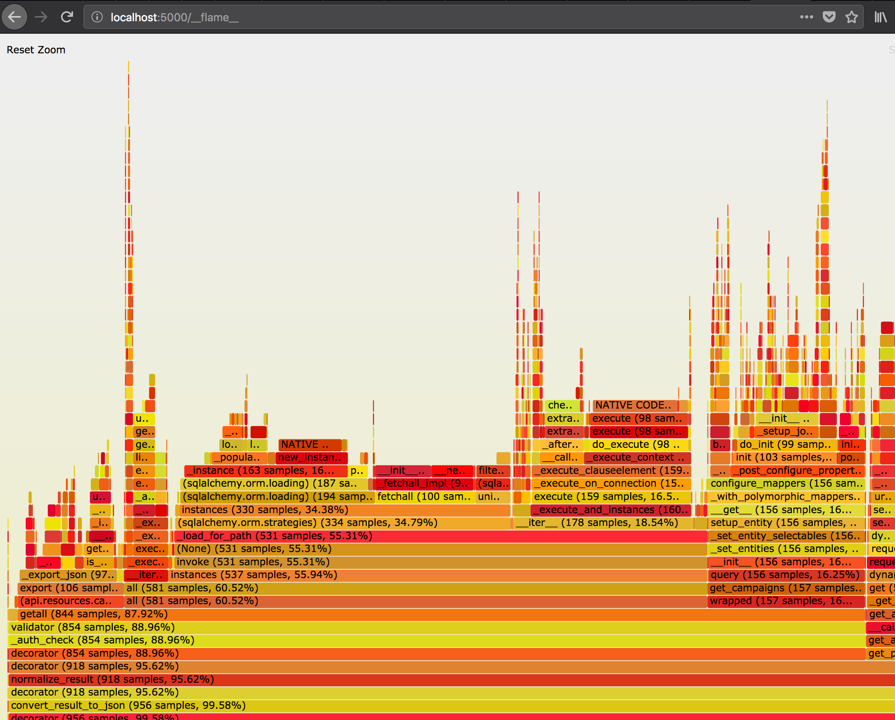

# flask-flamegraph - a library for profiling flask request.

flask-flamegraph helps you quickly understand:

* Where all the time is being spent in your endpoints
* How deep your callstacks are
* Where the lowest hanging fruit is for optimization

## Install

    pip install git+https://github.com/binderclip/flask-flamegraph.git

## Quickstart Example

    import flask
    import flask_flamegraph

    flask_flamegraph = flask_flamegraph.FlaskFlamegraph()

    def create_app():
        app = flas.Flask(__name__)
        flask_flamegraph.init_app(app)
        return app

    if __name__ == '__main__':
        app = create_app()
        app.run(use_reloader=False, use_debugger=False, threaded=False)

After this, hit any of your routes, and navigate to `http://localhost:5000/__flame__`
(Remember to restart the app after update code because `use_reloader=False`)

## Testing

Run the tests:

    pytest

## Attributions

This plugin is largely based upon [flask-debugtoolbar-flamegraph](https://github.com/quantus/flask-debugtoolbar-flamegraph),
but with inspiration from [sqltap](https://github.com/inconshreveable/sqltap) for adding a separate `__flame__` endpoint
to more naturally support json-only apis instead of template rendered pages.

Also, impossible to do without the [flamegraph](https://github.com/brendangregg/FlameGraph)
project iteself.
